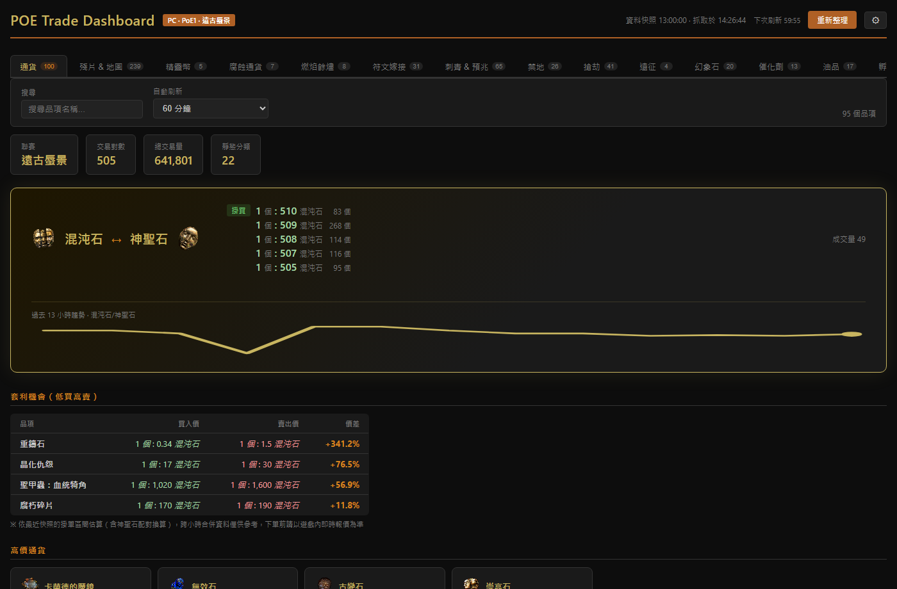

# POE Trade Dashboard

Path of Exile（PoE1，PC realm）通貨交易所儀表板：FastAPI 後端代理官方 API（處理嚴格限流、合併逐小時快照），前端以五檔報價風格呈現買賣盤。



---

## 功能

- **混沌石 ↔ 神聖石 Hero Card**：兩大計價基準的即時掛買/掛賣，附過去數小時混沌/神聖石匯率走勢折線圖
- **五檔價位階梯**：掛賣/掛買各列最多 5 個價位檔與掛單量（由逐小時快照彙整的近期觀測價位）
- **套利機會表**：自動掃出「最便宜掛賣 < 最高掛買」的品項，含跨基準幣（混沌↔神聖）換算比較
- **價格趨勢 Sparkline**：各通貨卡片底部附小型折線圖，直觀呈現近期報價走勢
- **價格排序**：各分組內依神聖石等值價格由高到低排列
- **顯示以實際掛單為準**：混沌石行/神聖石行各自來自真實配對市場，標價固定「1 個 : N 基準幣」
- **22 個物品分類**：通貨、殘片、精華、分裂卡、地圖… 均以標籤分頁呈現
- **繁體中文介面**：名稱以官方 TW API 為準，支援中文搜尋
- **快照快取**：過去整點快照不可變、永久快取於 `data/cache/`，涵蓋率隨運行時間累積
- **自動刷新**：可設定 5 / 15 / 30 / 60 分鐘（資料粒度為 1 小時，建議 ≥15 分鐘）
- **Demo 模式**：後端未啟動時可用本地假資料預覽

---

## 快速開始

1. 前往 [pathofexile.tw/developer](https://www.pathofexile.tw/developer/docs/) 申請 API 應用
   - 類型：**Confidential Client**、Scope：`service:cxapi`
2. 在專案根目錄建立 `.env`：

   ```
   CLIENT_ID=你的client_id
   CLIENT_SECRET=你的client_secret
   ```

3. 啟動：

   ```
   pip install -r requirements.txt
   python server.py
   ```

4. 開啟 http://localhost:8000

憑證只存在本機 `.env`（已 gitignore），瀏覽器端不經手。無憑證時點右上角 ⚙ 可切換 Demo 模式。

---

## 讀懂報價卡片

```
┌──────────────────────────────────┐
│ [img]  崇高石                     │
│ 1 個 : 1 混沌石     ← 參考價（掛賣優先）
│                                  │
│ 掛賣  1 個 : 1 混沌石    1.6K 個   │ ← 可向掛單者買入
│       1 個 : 2 混沌石    600 個    │   （由便宜到貴，最多 5 檔）
│ 掛買  1 個 : 4 混沌石    100 個    │ ← 可賣給掛單者
│       1 個 : 1 混沌石    1.7K 個   │   （由高到低，最多 5 檔）
│                                  │
│ 成交量 19                         │
└──────────────────────────────────┘
```

| 欄位 | 說明 |
|------|------|
| **掛賣（紅）** | 有人正在賣出這個通貨，由便宜到貴最多 5 檔，可直接買入 |
| **掛買（綠）** | 有人正在收購這個通貨，由高到低最多 5 檔，可直接賣出 |
| **價位檔數量** | 該價位被觀測到當時的掛單量（API 不保證量價精確配對，僅供參考深度） |
| **成交量** | 最近快照中目標通貨的換手數量 |

註：官方 API 每市場每小時只提供最佳/最差兩端聚合值，五檔是合併多個小時快照彙整的「近期觀測價位」，非即時掛單簿，下單前請以遊戲內報價為準。

---

## 資料來源

- **交易所資料**：[Path of Exile Currency Exchange API](https://www.pathofexile.tw/developer/docs/reference#currencyexchange)（每小時更新，有 5 分鐘延遲）
- **品項靜態資料**：[POE Trade Static API](https://www.pathofexile.tw/api/trade/data/static)
- **通貨圖示**：web.poecdn.com（Grinding Gear Games 官方 CDN）

---

## 專案結構

```
poe-trade-dashboard/
├── server.py                        # FastAPI 後端：API 代理、快照合併、限流節流
├── index.html                       # 主頁面
├── assets/
│   ├── app.js                       # 全部前端邏輯：五檔、排序、套利
│   ├── zh-names.js                  # 繁中名稱 fallback 對照
│   └── style.css                    # POE 黑金主題
├── public/res/img/                  # 本地通貨圖示（28 個 PNG）
├── data/
│   ├── cache/                       # 整點快照永久快取（gitignore）
│   └── mock-currency-exchange.json  # Demo 假資料
├── poe_static.json                  # 靜態品項資料 fallback（22 分類）
├── scripts/
│   ├── test-orderbook.mjs           # 掛單簿解析單元測試
│   ├── debug-api.mjs                # API 連線除錯工具
│   └── download-imgs.py             # 通貨圖示下載工具
└── .github/workflows/fetch-data.yml # 手動 GitHub Action（備用）
```

開發說明詳見 [CLAUDE.md](./CLAUDE.md)。

---

## License

本專案為非官方工具，與 Grinding Gear Games 無關。Path of Exile 及所有遊戲素材版權歸 Grinding Gear Games 所有。
